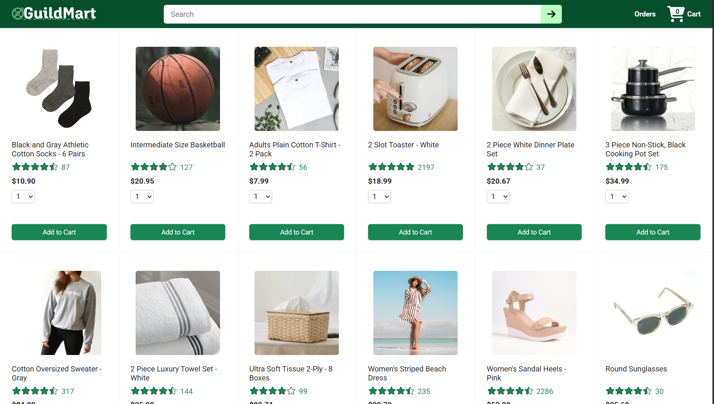

<div align="center">

# 🛒 React Ecommerce



A responsive Ecommerce web application built with **React** and **Vite**, using a **local backend API** for managing cart and product data.


</div>

---

## 📖 About The Project

React Ecommerce is a frontend Ecommerce application developed using **React** and **Vite**. The application communicates with a **local backend API** to fetch and display shopping cart data while providing multiple pages for browsing, checkout, order history, and order tracking.

The project focuses on building a scalable React application using reusable components and client-side routing.

---

## ✨ Features

- 🏠 Home Page
- 🛍️ Product Display
- 🛒 Shopping Cart
- 💳 Checkout Page
- 📦 Orders Page
- 🚚 Order Tracking
- 🔄 Dynamic Data Fetching with Axios
- 🌐 Client-side Routing
- ⚡ Local Backend Integration
- 📱 Responsive Layout

---

## 🛠️ Tech Stack

### Frontend

- React 19
- Vite
- React Router
- Axios
- Day.js
- JavaScript (ES6+)
- HTML5
- CSS3

### Backend

- Local REST API

---

## 📂 Folder Structure

```text
React-Ecommerce/
│
├── ecommerce-backend/
│
├── public/
│
├── src/
│   ├── assets/
│   ├── components/
│   ├── pages/
│   │   ├── home/
│   │   ├── checkout/
│   │   ├── orders/
│   │   ├── TrackingPage.jsx
│   │   └── TrackingPage.css
│   │
│   ├── starting-code/
│   ├── utils/
│   ├── App.jsx
│   ├── App.css
│   ├── index.css
│   └── main.jsx
│
├── public/
├── package.json
├── vite.config.js
├── eslint.config.js
└── README.md
```

---

## 🚀 Getting Started

### Clone the Repository

```bash
git clone https://github.com/armanpreet-singh/React-Ecommerce.git
```

### Navigate to the Project

```bash
cd React-Ecommerce
```

### Install Dependencies

```bash
npm install
```

### Start the Development Server

```bash
npm run dev
```

The application will be available at:

```
http://localhost:5173
```

---

## ⚙️ Running the Backend

This project uses a local backend located in the **ecommerce-backend** folder.

Open a new terminal:

```bash
cd ecommerce-backend
```

Install dependencies (if required):

```bash
npm install
```

Run the backend server:

```bash
npm start
```

Make sure the backend is running before starting the React application.

---

## 📄 Pages

| Page | Description |
|------|-------------|
| 🏠 Home | Displays products |
| 🛒 Checkout | Checkout process |
| 📦 Orders | View placed orders |
| 🚚 Tracking | Track order status |

---

## 📚 Project Structure

The project is organized into separate folders for better scalability.

- **assets** → Images and static resources
- **components** → Reusable UI components
- **pages** → Individual application pages
- **utils** → Utility/helper functions
- **ecommerce-backend** → Local backend server

---

## 🎯 Learning Outcomes

This project helped me strengthen my understanding of:

- React Components
- React Hooks
- React Router
- Axios API Calls
- State Management
- Component Reusability
- Local Backend Integration
- Folder Organization
- Responsive UI Development

---


## 🔮 Future Improvements

- User Authentication
- Product Search
- Wishlist
- Online Payment Gateway
- Admin Dashboard
- Product Reviews
- Better State Management
- Database Integration

---

## 👨‍💻 Author

**Armanpreet Singh**

- GitHub: https://github.com/armanpreet-singh

---

## ⭐ Support

If you found this project helpful, consider giving it a **⭐ Star** on GitHub.

It motivates me to build more awesome projects!

---

